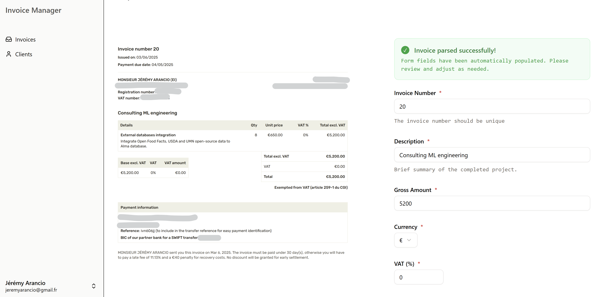
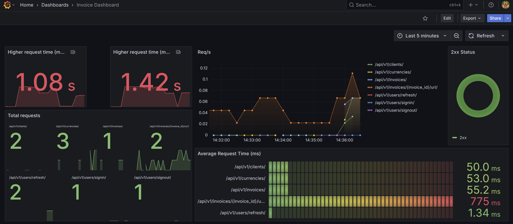

<a id="readme-top"></a>

[![Contributors][contributors-shield]][contributors-url]
[![Forks][forks-shield]][forks-url]
[![Stargazers][stars-shield]][stars-url]
[![Issues][issues-shield]][issues-url]
[![Unlicense License][license-shield]][license-url]
[![LinkedIn][linkedin-shield]][linkedin-url]


<!-- PROJECT LOGO -->
<br />
<div align="center">
  <a href="https://github.com/jeremyarancio/invoice-reader-app">
    
  </a>

  <h3 align="center">Invoice Manager</h3>

  <p align="center">
    A web app to manage your invoices.
    <br />
    <a href="https://app.myinvoicemanager.pro/"><strong>Discover the App >></strong></a>
    <br />
    <a href="https://github.com/jeremyarancio/invoice-reader-app/issues/new?labels=Bug&template=bug-report---.md">Report Bug</a>
    &middot;
    <a href="https://github.com/jeremyarancio/invoice-reader-app/issues/new?labels=enhancement&template=feature-request---.md">Request Feature</a>
  </p>
</div>


<!-- TABLE OF CONTENTS -->
<details>
  <summary>Table of Contents</summary>
  <ol>
    <li>
      <a href="#about-the-project">About The Project</a>
      <ul>
        <li><a href="#built-with">Built With</a></li>
      </ul>
    </li>
    <li>
      <a href="#getting-started">Getting Started</a>
      <ul>
        <li><a href="#prerequisites">Prerequisites</a></li>
        <li><a href="#installation">Installation</a></li>
      </ul>
    </li>
    <li><a href="#contributing">Contributing</a></li>
    <li><a href="#contact">Contact</a></li>
  </ol>
</details>


<!-- ABOUT THE PROJECT -->
## About The Project

[](assets/Screenshot.png)

As a consultant in Machine Learning, I deal with various invoice templates, from platforms or my own. 
This leads to adding a lot of information manually.

Frustrated to not have a tool to manage my invoices, *I decided to build my own!*

The application allows you to:

* Upload your Invoices and automatically parse them with open-source AI models. **This means your data is not sent to OpenAI or Google!**
* Manage your invoices and clients in one place.
* Get insights about your consulting service across your projects.

Feel free to explore the code and test the [App](https://app.myinvoicemanager.pro/)!

<p align="right">(<a href="#readme-top">back to top</a>)</p>


### Built With

[](https://skillicons.dev)

The application is developed as follows: 

* **FastAPI** for the Server
* **React + TypeScript + Tailwind** for the UI
* **Docker Compose** for the deployment in production (VPS on Hostinger)
* **Prometheus& Grafana** for the monitoring
* **Traefik** as a Reverse Proxy & Load Balancer
* **PostgresSQL + SQLModel** for the database
* **Alembic** for Database migration
* **AWS S3** for storing documents
* **Document Parsing** powered by [Together AI](https://www.together.ai/) & **Qwen-2.5-VL-72B**

You'll also find in this repository, under `./infrastructure`, different ways to deploy the application in the cloud, such as AWS ECS or Kubernetes.

<p align="right">(<a href="#readme-top">back to top</a>)</p>

## Getting Started

### Prerequisites

To run the application locally, you need Docker installed.

Also, to keep the user session active using Cookies, you need to create a new local domain, such as `localdev.test`.
To do so, add to your `etc/hosts` file the following domain and subdomains: 

```
127.0.0.1  localdev.test app.localdev.test api.localdev.test monitor.localdev.test
```

This will redirect your requests from `localhost` to your new custom domain.

### Installation

1. Clone the repo
   ```sh
   git clone git@github.com:jeremyarancio/invoice-reader-app.git
   ```
2. Add your Environment Variables to the different `.env` files under: *`./`*, *`./server`*, *`./ui`* 
3. With Docker, run:

```sh
docker compose up -d --build
```
4. The application should be available at:
    * `app.localdev.test` for the UI
    * `api.localdev.test` for the server. The server being built with FastAPI, you can check the endpoints at `api.localdev.test/docs`
    * `monitor.locadev.test` for the monitoring dashboard. (*Notes: you should add the datasource to Grafana* - WIP)

<br>



<p align="right">(<a href="#readme-top">back to top</a>)</p>


<!-- CONTRIBUTING -->
## Contributing

Contributions are what make the open source community such an amazing place to learn, inspire, and create. Any contributions you make are **greatly appreciated**.

If you have a suggestion that would make this better, please fork the repo and create a pull request. You can also simply open an issue with the tag "enhancement".
Don't forget to give the project a star! Thanks again!

1. Fork the Project
2. Create your Feature Branch (`git checkout -b feature/AmazingFeature`)
3. Commit your Changes (`git commit -m 'Add some AmazingFeature'`)
4. Push to the Branch (`git push origin feature/AmazingFeature`)
5. Open a Pull Request


<!-- CONTACT -->
## Contact

[](https://www.linkedin.com/in/jeremy-arancio/)
[](https://medium.com/@jeremyarancio)
[](mailto:jeremyarancio.freelance@gmail.com)


<p align="right">(<a href="#readme-top">back to top</a>)</p>


<!-- MARKDOWN LINKS & IMAGES -->
<!-- https://www.markdownguide.org/basic-syntax/#reference-style-links -->
[contributors-shield]: https://img.shields.io/github/contributors/jeremyarancio/invoice-reader-app?style=for-the-badge
[contributors-url]: https://github.com/jeremyarancio/invoice-reader-app/graphs/contributors
[forks-shield]: https://img.shields.io/github/forks/jeremyarancio/invoice-reader-app?style=for-the-badge
[forks-url]: https://github.com/jeremyarancio/invoice-reader-app/network/members
[stars-shield]: https://img.shields.io/github/stars/jeremyarancio/invoice-reader-app.svg?style=for-the-badge
[stars-url]: https://github.com/jeremyarancio/invoice-reader-app/stargazers
[issues-shield]: https://img.shields.io/github/issues/jeremyarancio/invoice-reader-app.svg?style=for-the-badge
[issues-url]: https://github.com/jeremyarancio/invoice-reader-app/issues
[license-shield]: https://img.shields.io/github/license/jeremyarancio/invoice-reader-app.svg?style=for-the-badge
[license-url]: https://github.com/jeremyarancio/invoice-reader-app/blob/master/LICENSE.txt
[linkedin-shield]: https://img.shields.io/badge/-LinkedIn-black.svg?style=for-the-badge&logo=linkedin&colorB=555
[linkedin-url]: https://www.linkedin.com/in/jeremy-arancio/

